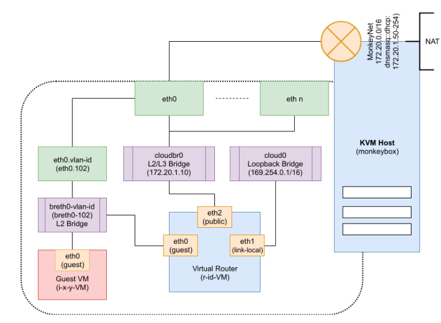
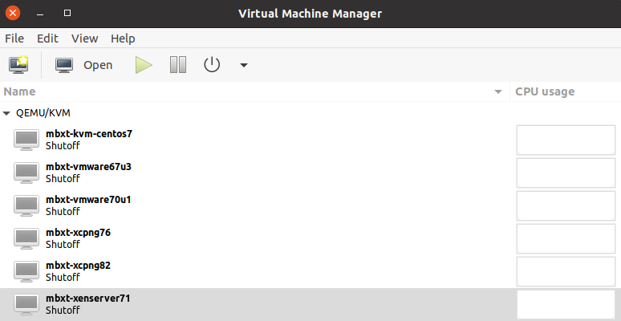
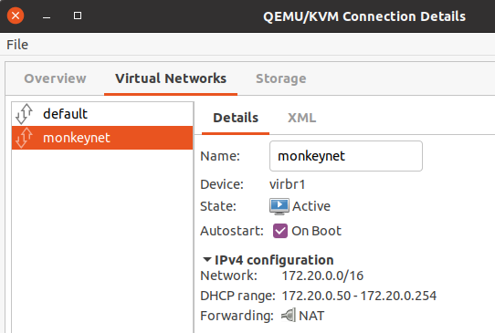

# mbx 🐒📦

MonkeyBox `mbx` enables building CloudStack packages and deploying CloudStack
dev and qa environment using pre-built DHCP-enabled VM templates.

Table of Contents
=================

* [Architecture](#architecture)
    * [Storage](#storage)
    * [Networking](#networking)
    * [Deployment](#deployment)
* [Compatibility](#compatibility)
* [Installation and Setup](#installation-and-setup)
    * [Setup NFS Storage](#setup-nfs-storage)
    * [Setup KVM](#setup-kvm)
    * [Setup mbx](#setup-mbx)
* [Using mbx](#using-mbx)
* [CloudStack Development](#cloudstack-development)
    * [Install Development Tools](#install-development-tools)
    * [Setup MySQL Server](#setup-mysql-server)
    * [Setup NFS storage](#setup-nfs-storage-1)
    * [Dev: Build and Test CloudStack](#dev-build-and-test-cloudstack)
    * [Debugging CloudStack](#debugging-cloudstack)
* [Contributing](#contributing)
* [Troubleshooting](#troubleshooting)
    * [iptables](#iptables)

## Architecture

An `mbx` environment consists of VMs that runs the CloudStack management server
and hypervisor hosts. These VMs are provisioned on a local host-only `monkeynet`
network which is a /16 nat-ed RFC1918 IPv4 network. The diagram above shows how
nested guest VMs and virtual router are plugged in nested-virtual networks that
run in a nested KVM host VM.

To learn more about CloudStack as a user, you may read:

https://github.com/shapeblue/hackerbook/blob/main/0-init.md

https://github.com/shapeblue/hackerbook/blob/main/1-user.md

### Storage

`mbx` requires NFS storage to be setup and exported for the base path
`/export/testing` for environment-specific primary and secondary storages.

A typical `mbx` environment upon deployment creates two primary storage
directories (`primary1` and `primary2`) and one secondary storage directory
(`secondary`). The secondary storage directory is seeded with supported
CloudStack version-specific `systemvmtemplates` if necessary when the env is
launched using `mbx launch`. The seeded `systemvmtemplate` is then used to
create system VMs such as the Secondary-Storage VM, Console-Proxy VM and Virtual
Router in an `mbx` environment.

### Networking

`mbx` requires a local 172.20.0.0/16 natted network such that the VMs on this
network are only accessible from the workstation/host but not by the outside
network. The `mbx init` command initialises this network.

    External Network
      .                     +-----------------+
      |              virbr1 | MonkeyBox VM1   |
      |                  +--| IP: 172.20.0.10 |
    +-----------------+  |  +-----------------+
    | Host x.x.x.x    |--+
    | IP: 172.20.0.1  |  |  +-----------------+
    +-----------------+  +--| MonkeyBox VM2   |
                            | IP: 172.20.x.y  |
                            +-----------------+

The 172.20.0.0/16 RFC1918 private network is used, as the other 192.168.x.x and
10.x.x.x CIDRs may already be in use by VPN, lab resources and office/home networks.

To keep the setup simple, all MonkeyBox VMs have a single NIC which can be
used as a single physical network in CloudStack that has the public, private,
management/control and storage networks. A complex setup is possible by adding
multiple virtual networks and nics on them.

### Deployment

For QA env, `mbx` will deploy a single `mgmt` VM that runs the management
server, the usage server, MySQL server, marvin integration tests etc. and two
hypervisor host VMs.

For Dev env, `mbx` will deploy a single hypervisor host VM and the management
server, usage server, MySQL server etc. are all run from the workstation/host by
the developer.

For both QA and Dev environments, the environment-specific NFS storage are
generally directories under `/export/testing` which serve as both primary and
secondary storage.

The `mbx` templates are initialised and downloaded at
`/export/monkeybox/templates/`.

The `mbx` environments, their configurations and VM disks are hosted at
`/export/monkeybox/boxes/`.

## Compatibility

Host requirements:
- Ubuntu 22.04 LTS (recommended) or EL8/9**
- Recommended 32GB RAM with Intel VT-x or AMD-V enabled 4+cores CPU
- Uninstall any other hypervisor software (such as VMware workstation, VirtualBox)

**Note: `mbx` has been tested and developed on Ubuntu 20.04 and 22.04 LTS; VMware environment require vmxnet3 which may not be supported on EL environments

Supported Management Server (Templates):
- EL7 (CentOS 7)
- EL8 (AlmaLinux 8)
- EL9 (AlmaLinux 9)

Supported Hypervisors (Templates):
- KVM: EL7, EL8, EL9
- VMware vSphere: 6.7u3, 7 (7.0u3), 8 (8.0)
- XCP-ng: 8.2
- XenServer: 7.1 LSTR

Tested CloudStack versions:
- 4.16
- 4.17
- 4.18

- MBX QA environment deployment supported with CloudStack versions: 4.11 or later.
- MBX development supported with CloudStack version 4.16 and later.
- Smoketests supported CloudStack versions: 4.16 or later.

Note: legacy CloudStack releases older than v4.11 that don't have
`cloudstack-marvin` package will not work.

Refer to https://docs.cloudstack.apache.org for CloudStack version-specific
hypervisor and distro compatibility matrix.

## Installation and Setup

Video: https://shapeblue-engineering-videos.s3.eu-west-1.amazonaws.com/mbx/mbx-installation.mp4

`mbx` requires:

- NFS storage
- (Baremetal) QEMU/KVM host for running nested VMs (Ubuntu and CentOS have been tested)
- Docker for building CloudStack packages: https://docs.docker.com/engine/install/ubuntu/

Additional notes:
- Default password for all `mbx` templates for the root user is `P@ssword123`.
- Default password for CloudStack `admin` user is `password`.

### Setup NFS Storage

On Ubuntu:

    apt-get install nfs-kernel-server quota sshpass wget jq bc
    echo "/export  *(rw,sync,no_root_squash,no_subtree_check)" > /etc/exports
    mkdir -p /export/testing
    exportfs -a
    sed -i -e 's/^RPCMOUNTDOPTS="--manage-gids"$/RPCMOUNTDOPTS="-p 892 --manage-gids"/g' /etc/default/nfs-kernel-server
    sed -i -e 's/^STATDOPTS=$/STATDOPTS="--port 662 --outgoing-port 2020"/g' /etc/default/nfs-common
    echo "NEED_STATD=yes" >> /etc/default/nfs-common
    sed -i -e 's/^RPCRQUOTADOPTS=$/RPCRQUOTADOPTS="-p 875"/g' /etc/default/quota
    service nfs-kernel-server restart

On EL8 (Rocky Linux 8):

    dnf install -y epel-release
    dnf install nfs-utils sshpass wget jq bc
    echo "/export  *(rw,sync,no_root_squash,no_subtree_check)" > /etc/exports
    mkdir -p /export/testing

    # Add the following to /etc/sysconfig/nfs
    LOCKD_TCPPORT=32803
    LOCKD_UDPPORT=32769
    MOUNTD_PORT=892
    RQUOTAD_PORT=875
    STATD_PORT=662
    STATD_OUTGOING_PORT=2020    

    # Start NFS and rpcbind
    systemctl enable --now rpcbind
    systemctl enable --now nfs-server

    # Disable/configure firewalld as necessary
    systemctl disable --now firewalld

### Setup KVM

On Ubuntu:

    apt-get install qemu-kvm libvirt-daemon libvirt-daemon-system libvirt-clients bridge-utils virtinst cpu-checker libnss-libvirt sysfsutils
    kvm-ok

On EL8 (Rocky Linux 8):

    yum install bridge-utils net-tools chrony qemu-kvm qemu-img libvirt libvirt-daemon libvirt-daemon-driver-qemu libvirt-nss virt-install

On Ubuntu, fixing permissions for libvirt-qemu (for non-root users):

    sudo getfacl -e /export
    sudo setfacl -m u:libvirt-qemu:rx /export

On EL8/Rocky Linux, add polkit rule to allow non-root users to use virsh (replace 'rohit' with your username):

    # cat /etc/polkit-1/rules.d/50-org.libvirt.unix.manage.rules
    polkit.addRule(function(action, subject) {
        if (action.id == "org.libvirt.unix.manage" &&
            subject.user == "rohit") {
                return polkit.Result.YES;
                polkit.log("action=" + action);
                polkit.log("subject=" + subject);
        }
    });

Note: mbx depends on Libvirt NSS for name resolution; replace `rohit` with your username on the host.

Next, add the `libvirt libvirt_guest` in the nss config file, following so that `grep -w 'hosts:' /etc/nsswitch.conf` returns: (note: ensure the same order as below)

    files libvirt libvirt_guest dns mymachines

For Ubuntu, allow non-root users to add tap interfaces to a bridge:

    sudo chmod u+s /usr/lib/qemu/qemu-bridge-helper
    sudo bash -c 'mkdir -p /etc/qemu && echo "allow virbr0" >>/etc/qemu/bridge.conf && echo "allow virbr1" >>/etc/qemu/bridge.conf'

For EL8/Rocky Linux, do this:

    sudo bash -c 'mkdir -p /etc/qemu-kvm && echo "allow virbr0" >> /etc/qemu-kvm/bridge.conf && echo "allow virbr1" >> /etc/qemu-kvm/bridge.conf'

Install `virt-manager`, the virtual machine manager graphical tool to manage VMs on your machine.

On Ubuntu:

    apt-get install virt-manager

On EL8 (Rocky Linux 8):

    yum install -y virt-manager

### Setup `mbx`

    git clone https://github.com/shapeblue/mbx /export/monkeybox

    # Enable mbx under $PATH, for bash:
    echo export PATH="/export/monkeybox:$PATH" >> ~/.bashrc
    # Enable mbx under $PATH, for zsh:
    echo export PATH="/export/monkeybox:$PATH" >> ~/.zshrc

    # Initialise `mbx` by opening in another shell:
    mbx init

The `mbx init` should be run on first install and on upgrade which will update
templates and domain xmls. When mbx init is executed on upgrade, ensure no mbx
VMs are running.

The `mbx init` command initialises the `monkeynet` network. You can check and confirm the
network using:

    $ virsh net-list --all
    Name                 State      Autostart     Persistent
    ----------------------------------------------------------
    default              active     yes           yes
    monkeynet            active     yes           yes

Alternatively, you may open `virt-viewer` manager and click on:

    Edit -> Connection Details -> Virtual Networks

You may also manually add/configure a virtual network with NAT in 172.20.0.0/16
like below:

This will create a virtual network with NAT and CIDR 172.20.0.0/16, the gateway
`172.20.0.1` is also the workstation/host's virtual bridge IP. The virtual network's
bridge name `virbrX` may be different and it does not matter as long as you've a
NAT-enabled virtual network in 172.20.0.0/16.

    Your workstation/host IP address is `172.20.0.1`.

## Using `mbx`

Video: https://shapeblue-engineering-videos.s3.eu-west-1.amazonaws.com/mbx/mbx-usage-demo.mp4

The `mbx` tool can be used to build CloudStack packages, deploy dev or QA
environments with KVM, VMware, XenServer and XCP-ng hypervisors, and run
smoketests on them.

    $ mbx
    MonkeyBox 🐵 v0.3
    Available commands are:
      init: initialises monkeynet and mbx templates
      package: builds packages from a git repo and sha/tag/branch
      list: lists available environments
      deploy: creates QA env with two monkeybox VMs and creates marvin cfg file
      launch: launches QA env zone using environment's marvin cfg file
      test: start marvin tests
      dev: creates dev env with a single monkeybox VM and creates marvin cfg file
      agentscp: updates KVM agent in dev environment using scp and restarts it
      ssh: ssh into a mbx VM
      stop: stop all env VMs
      start: start all env VMs
      destroy: destroy environment

0. On first run or when upgrading `mbx`, please run:

    mbx init

1. To list available environments and `mbx` templates (mbxts), run:

    mbx list

2. To deploy an environment, run:

    mbx deploy <name of env, default: mbxe> <mgmt server template, default: mbxt-kvm-el7> <hypervisor template, default: mbxt-kvm-el7> <repo, default: http://packages.shapeblue.com/cloudstack/upstream/el7/4.18>

Example to deploy test matrix (kvm, vmware, xenserver) environments:

    mbx deploy 418-kenv mbxt-kvm-el8 mbxt-kvm-el8 # deploys ACS 4.18 + KVM EL8 env
    mbx deploy 418-venv mbxt-kvm-el8 mbxt-vmware7 # deploys ACS 4.18 + VMware7(u3) env
    mbx deploy 418-xenv mbxt-kvm-el8 mbxt-xcpng82 # deploys ACS 4.18 + XCP-ng 8.2 env

More examples with custom packages repositories:

    mbx deploy cs417-kvm mbxt-kvm-el7 mbxt-kvm-el7 http://download.cloudstack.org/centos/7/4.17/

3. Once `mbx` environment is deployed, to launch a zone run:

    mbx launch <name of the env, run `mbx list` for env name>

4. To run smoketests, run:

    mbx list # find your environment
    mbx ssh <name of the mbx mgmt server VM>
    cd /marvin
    bash -x smoketests.sh

5. To destroy your mbx environment, run:

    mbx destroy <name of the env, see mbx list for env name>

Note: to use `qemu-ev` on EL7 KVM hosts, after deploying an environment you
can run the following on KVM hosts (before launching the zone):

    yum install centos-release-qemu-ev
    yum install qemu-kvm-ev

### Accessing MBX Remotely

This section is only for mbx users who want to access their mbx environments remotely.
For this we suggest setting up wireguard VPN.

To setup wireguard on Ubuntu: (note replace `LIBVIRT_PRT` with the chain name that libvirt uses for NAT rules)

    sudo apt-get install wireguard resolvconf
    wg genkey | sudo tee /etc/wireguard/private.key
    sudo cat /etc/wireguard/private.key | wg pubkey | sudo tee /etc/wireguard/public.key

    # cat /etc/wireguard/wg0.conf
    [Interface]
    PrivateKey = <your base64_encoded_private_key_goes_here>
    Address = 10.6.0.1/24
    PostUp = iptables -I FORWARD -i wg0 -j ACCEPT; iptables -t nat -I LIBVIRT_PRT -o cloudbr0 -j MASQUERADE
    PostDown = iptables -D FORWARD -i wg0 -j ACCEPT; iptables -t nat -D LIBVIRT_PRT -o cloudbr0 -j MASQUERADE
    #MTU = 1420
    ListenPort = 51820
    SaveConfig = true

    [Peer]
    <... add rest of the peer config here...>

Note: you'll need to allow/enable port 51820/udp.

You may need forwarding enabled if you're connecting to a peer WireGuard server,
add the following to /etc/sysctl.conf:

    net.ipv4.ip_forward=1

And then run:

    sysctl -p

Finally enable the server:

    sudo systemctl enable wg-quick@wg0.service
    sudo systemctl start wg-quick@wg0.service
    sudo systemctl status wg-quick@wg0.service

## MBX CloudStack Development

Note: this is not for developers of 3rd party integration/feature that don't
require changes in CloudStack, such developers should use a QA environment. MBX
development usage is supported to work with CloudStack 4.16 and onwards.

This section covers how a CloudStack developer can run management server and
MySQL server locally to do development of CloudStack using `mbx` dev boxes along
side an IDE and other tools.

For developer env, it is recommended that you run your favourite IDE such as
IntelliJ IDEA, text-editors, your management server, MySQL server and NFS server
(secondary and primary storages) on your workstation (not in a VM) where these
services can be accessible to VMs, KVM hosts etc. at your host IP `172.20.0.1`.

To deploy a dev env, you can run `mbx dev <name of env> <hypervisor template>`.
For example:

    $ mbx dev some-feature mbxt-kvm-el8

The above will deploy a single hypervisor host and generate a marvin config file
that you can use to deploy a zone.

To ssh into deployed hypervisor VM (with NSS configured), you can login by
simply using:

    $ mbx ssh <name of the dev VM or IP>

Refer to hackerbook for up-to-date guidance on learning CloudStack development:
https://github.com/shapeblue/hackerbook

### Install Development Tools

Run this:

    $ sudo apt-get install openjdk-11-jdk maven python-mysql.connector libmysql-java mysql-server mysql-client bzip2 nfs-common uuid-runtime python-setuptools ipmitool genisoimage

Setup IntelliJ (recommended) or any IDE of your choice. Get IntelliJ IDEA
community edition from:

    https://www.jetbrains.com/idea/download/#section=linux

Install pyenv, jenv as well.

Setup `aliasrc` that defines some useful bash aliases, exports and utilities
such as `agentscp`. Run the following while in the directory root:

    $ echo "source $PWD/files/aliasrc" >> ~/.bashrc
    $ echo "source $PWD/files/aliasrc" >> ~/.zshrc

You may need to `source` your shell's rc/profile or relaunch shell/terminal
to use `agentscp`.

### Setup MySQL Server

After installing MySQL server, configure the following settings in its config
file such as at `/etc/mysql/mysql.conf.d/mysqld.cnf` and restart mysql-server:

    [mysqld]

    sql-mode="STRICT_TRANS_TABLES,NO_ENGINE_SUBSTITUTION,ERROR_FOR_DIVISION_BY_ZERO,NO_ZERO_DATE,NO_ZERO_IN_DATE,NO_ENGINE_SUBSTITUTION"
    server_id = 1
    innodb_rollback_on_timeout=1
    innodb_lock_wait_timeout=600
    max_connections=1000
    log-bin=mysql-bin
    binlog-format = 'ROW'

### Setup NFS storage

After installing nfs server, configure the exports:

    echo "/export  *(rw,async,no_root_squash,no_subtree_check)" > /etc/exports
    mkdir -p /export/testing/primary /export/testing/secondary

Beware: For Dev env, before deploying a zone on your monkeybox environment, make
sure to seed the correct systemvmtemplate applicable for your branch. In your
cloned CloudStack git repository you can use the `cloud-install-sys-tmplt` to
seed the systemvmtemplate. Also note this may or may not be necessary depending
on your development base branch.

The following is an example to setup `4.15` systemvmtemplate which you should
run after deploying the CloudStack db: (please use CloudStack branch/version specific
systemvmtemplate)

    cd /path/to/cloudstack/git/repo
    wget http://packages.shapeblue.com/systemvmtemplate/4.15/systemvmtemplate-4.15.1-kvm.qcow2.bz2
    ./scripts/storage/secondary/cloud-install-sys-tmplt \
          -m /export/testing/secondary -f systemvmtemplate-4.15.1-kvm.qcow2.bz2 \
          -h kvm -o localhost -r cloud -d cloud

### Dev: Build and Test CloudStack

It's assumed that the directory structure is something like:

        /
        ├── $HOME/lab/cloudstack
        └── /export/monkeybox

Fork the repository at: github.com/apache/cloudstack, or get the code:

    $ git clone https://github.com/apache/cloudstack.git

Noredist CloudStack builds requires additional jars that may be installed from:

    https://github.com/shapeblue/cloudstack-nonoss

Clone the above repository and run the install.sh script, you'll need to do
this only once or whenever the noredist jar dependencies are updated in the above
repository.

Build using:

    $ mvn clean install -Dnoredist -P developer,systemvm

Deploy database using:

    $ mvn -q -Pdeveloper -pl developer -Ddeploydb

Run management server using:

    $ mvn -pl :cloud-client-ui jetty:run  -Dnoredist -Djava.net.preferIPv4Stack=true

Install marvin:

    $ sudo pip install --upgrade tools/marvin/dist/Marvin*.tar.gz

While in CloudStack's repo's root/top directory, run the folllowing to copy
agent scripts, jars, configs to your KVM host:

    $ cd /path/to/git-repo/root
    $ mbx agentscp 172.20.1.10  # Use the appropriate KVM box IP

Deploy datacenter using:

    $ python tools/marvin/marvin/deployDataCenter.py -i ../monkeybox/adv-kvm.cfg

Example, to run a marvin test:

    $ nosetests --with-xunit --xunit-file=results.xml --with-marvin --marvin-config=../monkeybox/adv-kvm.cfg -s -a tags=advanced --zone=KVM-advzone1 --hypervisor=KVM test/integration/smoke/test_vm_life_cycle.py

Note: Use nosetests-2.7 to run a smoketest, if you've nose installed for both Python2.7 and Python3.x in your environment.

When you fix an issue, rebuild cloudstack and push new changes to your KVM host
using `agentscp` which will also restart the agent:

    $ agentscp 172.20.1.10

Using IDEA IDE:
- Import the `cloudstack` directory and select `Maven` as build system
- Go through the defaults, in the profiles page at least select noredist, vmware
  etc.
- Once IDEA builds the codebase cache you're good to go!

### Debugging CloudStack

Prior to starting CloudStack management server using mvn (or otherwise), export
this on your shell:

    export MAVEN_OPTS="$MAVEN_OPTS -Xdebug -Xrunjdwp:transport=dt_socket,address=8787,server=y,suspend=n"

To remote-debug the KVM agent, put the following in
`/etc/default/cloudstack-agent` in your monkeybox and restart cloudstack-agent:

    JAVA=/usr/bin/java -Xdebug -Xrunjdwp:transport=dt_socket,address=8787,server=y,suspend=n

The above will ensure that JVM will start with debugging enabled on port 8787.
In IntelliJ, or your IDE/editor you can attach a remote debugger to this
address:port and put breakpoints (and watches) as applicable.

## Contributing

Report issues on https://github.com/shapeblue/mbx/issues

Send a pull request on https://github.com/shapeblue/mbx
